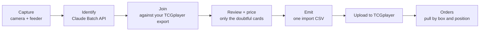

<p align="center">
  
</p>

<h1 align="center">Banchi</h1>

<p align="center">
  <b>Photograph a box of trading cards. Get a TCGplayer listing file back. Know where every card is.</b><br>
  <a href="https://shivinate7.github.io/banchi/">Try the live demo</a> |
  <a href="#quick-start">Quick start</a> |
  <a href="#how-it-works">How it works</a> |
  <a href="#change-it">Change it</a>
</p>

---

Banchi is a one-seller tool for a TCGplayer store. It sells pre-sorted singles from
Pokemon, One Piece and Riftbound. Each card needs a photo and nothing more from a person.
The software identifies the card, prices it and writes the import file.

A cheap single is worth less than the time it takes to list it by hand. So Banchi asks for
zero attention per card. A feeder puts each card on a tray under a camera. A browser screen
takes the photo. Claude identifies the cards later, in one batch. A person looks only at the
cards the software cannot resolve on its own.

The second job starts when a card sells. The name Banchi (番地) is the Japanese word for a
lot number, the address of a thing. Every card in the store has an address: box, then
section, then card. When an order comes in, Banchi tells you which box to open and where
the card sits in it.

## See it

**[shivinate7.github.io/banchi](https://shivinate7.github.io/banchi/)** runs the real app
against recorded server answers, not a live store. It runs on a copy of a real store, with
every buyer name replaced by "Jane Doe N" and every address replaced by "123 Demo Way."
Nothing you do there reaches a real store. GitHub rebuilds it on every push to `main` that
changes its inputs.

## How it works



Capture is fast, offline and dumb. Identification and pricing come later, in batch (D1, the
two-phase architecture). The split keeps the rig fast and makes every paid step deliberate.

| Step | What happens | Cost |
|---|---|---|
| Capture | The camera photographs each card. You record the box, game, set hint, finish and rarity one time for the pile. | Free |
| Identify | Claude Haiku vision reads each photo through the Batch API (D2). | Measured at $0.0012 to $0.0014 per card, so roughly $12 to $14 for each 10,000 cards |
| Join | Each card resolves against your TCGplayer Filtered Export to one SKU. | Free, re-runnable |
| Review | The app shows you one card at a time, photo first, for the cards the join could not settle. | Free |
| Price | You set a price or a hold for each SKU. The store keeps every answer. | Free |
| Emit | Banchi writes one import CSV for TCGplayer's Import to Staged. | Free, re-runnable |
| Reconcile | Banchi reads what TCGplayer staged, or your whole live book, and records what is live. | Free |

Only `identify` spends money. The app asks you to confirm before it spends.

## Quick start

Banchi runs on a Mac. It needs Python 3.12 (`python3.12` on the PATH; `make venv` builds `.venv` from it), Node.js and npm, `make` and `git`.
CI proves it on Ubuntu with Python 3.12 and Node 22.

```sh
git clone https://github.com/shivinate7/banchi.git pkmnscan
cd pkmnscan
make hooks                  # arm the git hooks. Once for each clone.
make status                 # what shipped, what is open, the branch
make venv                   # the Python packages, into .venv
npm --prefix app install    # the front end's packages
cp .env.example .env        # then add your ANTHROPIC_API_KEY
make up                     # start the app. Open the link that it prints.
```

The owner's checkout is named `pkmnscan`, so the clone above uses that name too.

**Do not skip `make hooks`.** Git does not push `core.hooksPath`, so a fresh clone has the
hooks on disk but not armed. Without them, a commit can leak a live code card and nothing
tells you. `make status` prints a `Git hooks` line, so an unarmed clone says so.

`make status` needs only the standard library. It runs before `make venv` and without an
API key.

### The keys in `.env`

`.env.example` explains each line. Write `.env` as plain text. A value already set in your
shell overrides the same line in `.env`.

| Key | Need | What it does |
|---|---|---|
| `ANTHROPIC_API_KEY` | Required | Card identification and harness test T1 |
| `POKEMONTCG_API_KEY` | Optional | Higher rate limits on pokemontcg.io |
| `TCGPLAYER_STORE_COOKIE` | Optional | Lets Banchi fetch your Filtered Export and your orders itself |
| `PKMNSCAN_TCG_SELLER_KEY` | With the cookie | The prefix of your order numbers. Not a secret. |
| `PKMNSCAN_TCG_USER_AGENT` | If blocked | Your browser's User-Agent, if TCGplayer refuses the price-history fetch |
| `PKMNSCAN_LAN_NAME` | Optional | A local DNS name, so a phone on your network can open the app and write |

Without the cookie, you download the Filtered Export from the seller portal and upload it
from Review's runs sheet. `make lan-check` tells you if the phone path works end to end.

## Use it

### The app

`make up` starts one server on one port. The capture server serves the API and the built
app together. It restarts when you edit Python and rebuilds the app when you edit a screen.
A build takes about one second. The old bundle serves until the new one is ready. If a
build fails, the last good bundle stays and `make status` tells you why.

Home, capture, review, pricing, orders, shipping, sales, inventory, graveyard, codes, cards
to pull, kit, product history, runs. Every one is in `app/src/App.tsx`'s `ROUTES` table,
open at a hash. Most sit in the nav. A few are off-nav on purpose: reached by a deep link,
the command palette, or a redirect into another screen's own sheet. The Fulfiller's screen
opens without the shell — every other screen carries it.

| Screen | Route | What it is for |
|---|---|---|
| Home | `#/` | What the store waits on, in one sentence, and one action |
| Capture | `#/capture` | The live camera, the pile's claims, undo and the motion trigger |
| Review | `#/review` | One card at a time, photo first. An "Identify N cards, ~$X" strip runs the pipeline from here when cards wait |
| Pricing | `#/pricing` | The hand-pricing worklist, one row for each SKU, with holds |
| Orders | `#/orders` | Open orders by buyer, and the walk to each copy |
| Shipping | `#/shipping` | TCGplayer's shipping export, sorted into envelopes |
| Sales | `#/revenue` | Gross revenue by month, and search by card name |
| Inventory | `#/inventory` | The box walk: search, copies and box operations |
| Graveyard | `#/graveyard` | Every card that left a box. Read-only. |
| Codes | `#/codes` | Code cards: the QR ledger and the hand-off (dormant) |
| Cards to pull | `#/fulfillment` | The Fulfiller's screen. Off-nav. |
| Kit | `#/gallery` | Every component of the design system. Off-nav, from the command palette. |
| Product history | `#/product` | The market history of one product and your own sales of it. Off-nav, deep-linked by SKU. |
| Runs | `#/runs` | Off-nav. A link into Review's own runs sheet — it opens no screen of its own. |

The app has two personas. The owner gets dense working screens. The Fulfiller is a
non-technical relative who pulls orders. The Fulfiller's screen has big type and large
touch targets, and it has no route out.

The app has no login and no auth. It is for your own desk and your own network.

Press `⌘K` for the command palette and `?` for every keyboard shortcut. To put Banchi in the
Dock, open `http://localhost:8000` in Chrome with the server up. Then use *Install page as
app*. The Dock app is only a window. `make launch-agent` starts the server at login.

### The CLI

Every step also runs from the terminal. `./pkmnscan --help` lists all commands.

```sh
./pkmnscan identify --dry-run <capture-dir>   # check everything, spend nothing
./pkmnscan identify <capture-dir>             # submit, wait, collect. COSTS MONEY.
./pkmnscan join     <run-dir>                 # resolve against the export
./pkmnscan emit     <run-dir> [<run-dir> ...] # one import CSV across runs
./pkmnscan reconcile --live <my-pricing.csv>  # the whole store against the live book
./pkmnscan reprice  list <my-pricing.csv>     # live listings that do not sell
./pkmnscan cards    audit                     # does each card still resolve to its photo
./pkmnscan boxes    names                     # give each unnamed box a default name
```

The commands that write to the store show a preview first. Add `--write` to apply.

### Where your data lives

The store is one SQLite file, `inventory/store.sqlite`. Set `PKMNSCAN_HOME` to move it.
It holds every card's address, every price answer, the order ledger and the history. Git
never tracks it. Each run writes to `runs/`, and you can delete a run folder at no cost.
**If you delete the store, you lose every answer that you paid for.**

## Change it

### Layout

| Path | What it holds |
|---|---|
| `app/` | Banchi, the front end. Vite, React 19 and TypeScript. |
| `app/src/tokens.css`, `app/src/kit/` | The design system: `--bn-*` tokens and the component kit |
| `server/` | The capture server. The only place where a route can spend money. |
| `pipeline/` | CSV, the variant ladder, pricing, the join and the routing |
| `identify/` | The prompt, the Batch API transport and image preparation |
| `geometry/` | Find the card in the frame |
| `store/` | The master store |
| `codes/` | The code-card feature (dormant) |
| `cli/`, `pkmnscan` | The CLI. Argument parsing only. |
| `harness/` | The verification tests |
| `fixtures/` | Real TCGplayer exports. Read-only ground truth. |
| `docs/` | Decisions, specs, gates and debts |
| `scripts/` | Guards, checks and the server supervisor |

The Python packages, the CLI, the store and the wire keep the old name, pkmnscan. Only the
front end is Banchi (D94, the app's name stops at the app). Do not rename the rest.

### Run it while you edit

```sh
make dev        # Vite with hot reload on :5173, beside `make up`
make harness    # the ten verification tests
make check      # everything that CI and the hooks enforce, and more
make ci-check   # the part of `check` that a fresh clone can prove
make down       # stop the server
```

`make server` runs the capture server alone in the foreground. It refuses to start beside
`make up`. A server on a different port would serve a different store (D43).

In a new git worktree, run `make worktree-setup` first. It gives the worktree its own venv,
its own test cache and its own ports. Without it, three harness tests fail with errors that
do not name the cause. In the main checkout, `make up` serves only the `main` branch.

### How a change lands

1. Work on a branch. The pre-commit hook runs the opsec rules and `make docs-audit`.
2. Open a pull request to `main`. CI runs `make ci-check`, a revert guard and a browser test matrix.
3. `make merge ARGS=<n>` previews the merge. `ARGS="<n> --confirm"` merges it (D42).

The docs audit reads this file too. When you add a screen or a command, update the count
and the list here, or the commit fails.

For a large feature, start with a spec. Ask Claude to interview you about edge cases and
trade-offs. Then have it write `docs/specs/<name>.md`. Execute the spec in a clean session.

### Three rules that protect real things

- **Never commit a photo of an unredeemed code card.** Anyone who reads the code owns it.
  Git ignores `captures/`. The hooks block the rest.
- **Never edit `fixtures/`.** `sv09_export_untouched.csv` is a real export of 341 rows.
  `staged-import-accepted.csv` is the two-row file that TCGplayer accepted. Hooks and
  `.claude/settings.json` enforce both.
- **Every color is a `--bn-*` token.** `app/src/tokens.css` is the only file in `app/`
  that can name a color. Check each screen in light and dark at 1440, 820 and 390 pixels.

### Read next

| File | Read it for |
|---|---|
| [`CLAUDE.md`](CLAUDE.md) | The full command reference and the rules that sessions follow |
| [`docs/decisions/`](docs/decisions/) | Each settled decision, one file each. `make map ARGS=D<n>` prints one. |
| [`docs/DESIGN.md`](docs/DESIGN.md) | The limits on the Fulfiller's screen |
| [`docs/GATES.md`](docs/GATES.md) | The record of the runs that proved the pipeline |
| [`docs/specs/`](docs/specs/) | The spec for each feature. `demo.md` explains the public demo. |

`make map` renders the whole repo as data. It names what is built, what is open and which
decision governs each file.

## Status

Banchi is the working tool of one seller. Gates A, B and C all passed in August
2026. Gate B took 53 real cards end to end. The repository has no license file, so the
default copyright applies.
